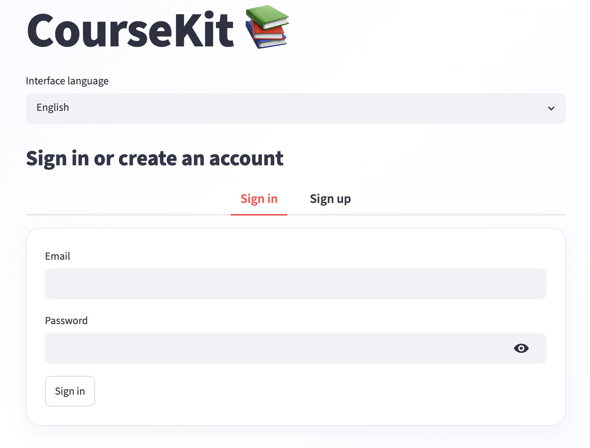
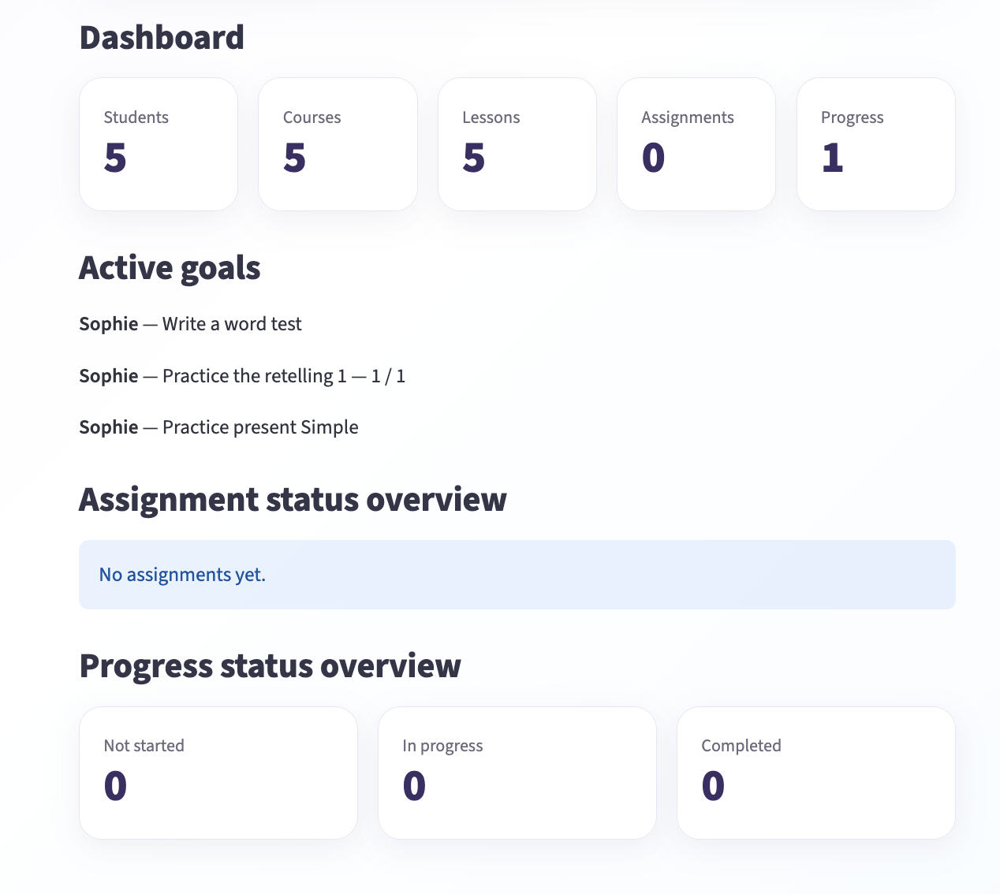
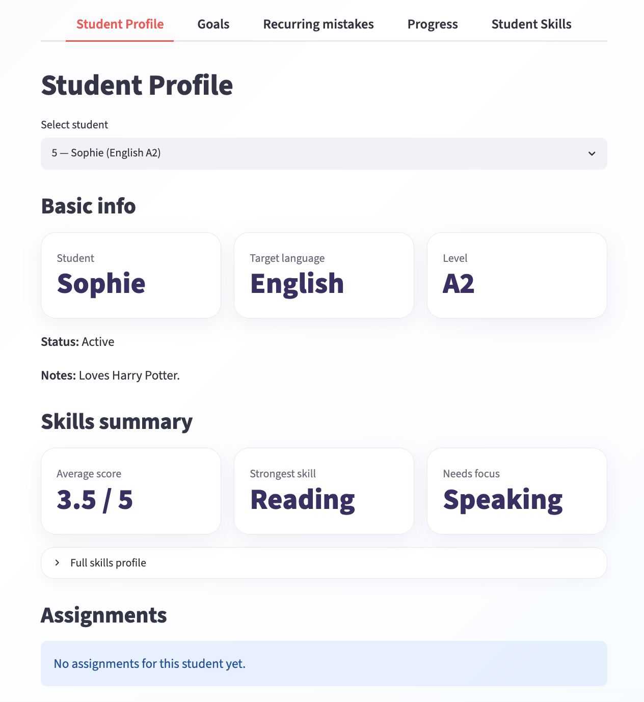
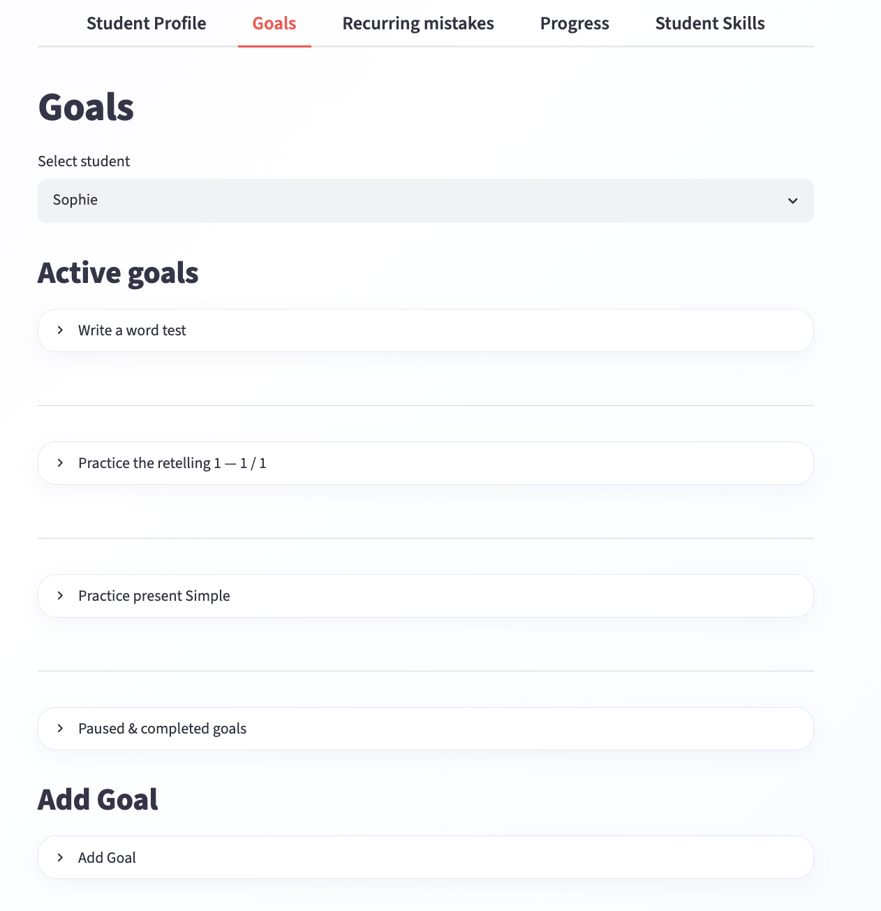
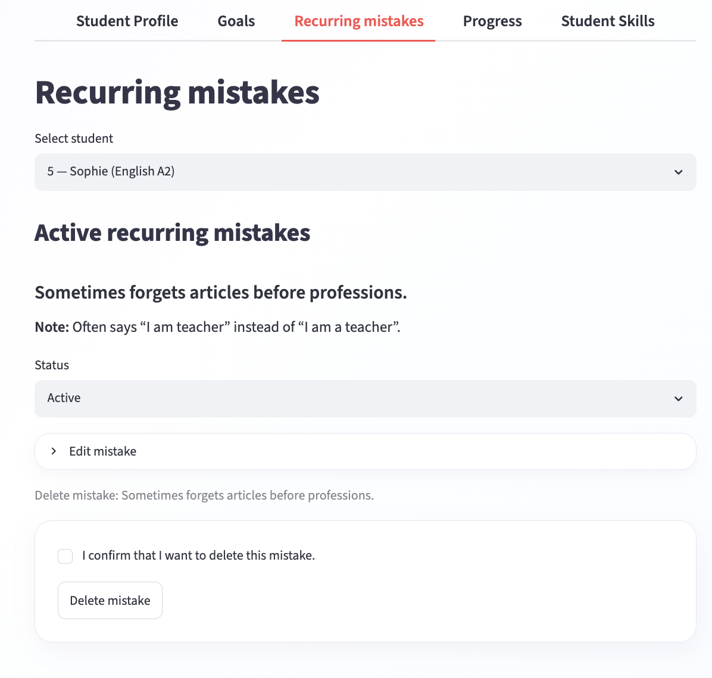

# CourseKit 📚

CourseKit is a lightweight mini LMS for language teachers and independent tutors.

It helps manage students, courses, lessons, assignments, learning goals, recurring mistakes, student skills, and progress in one Streamlit app.

The app includes user authentication and user-specific data access, so each teacher can sign in and manage their own workspace.

## ✨ Features

- User authentication with Supabase Auth
- Invite-only beta registration
- User-specific data access with Row Level Security policies
- Student management: add, edit, archive, restore, and delete students
- Student profiles with key learning information in one place
- Course management with subjects, target languages, levels, and custom levels
- Lesson planning: lesson goals, skills focus, materials, homework templates, dates, and resource links
- Lesson archive and restore workflow
- Assignment tracking: create, update, and delete assignments
- Student learning goals with milestones and target dates
- Goal progress tracking with milestone completion
- Active, paused, and completed goal statuses
- Recurring mistake tracking for individual students
- Active and resolved recurring mistake statuses
- Student skills tracking: listening, reading, speaking, writing, grammar, and vocabulary
- Progress tracking by student, course, and lesson
- Dashboard with key metrics, active goals, and status overviews
- Draft workflows for key forms
- English, Russian, and Chinese interface languages
- Mobile-friendly layout improvements

## 🛠️ Tech Stack

- Python
- Streamlit
- Pandas
- Supabase database
- Supabase Auth
- Row Level Security policies
- Custom CSS

## 📁 Project Structure

```text
CourseKit/
├── app.py
├── style.css
├── requirements.txt
├── .gitignore
├── README.md
├── .streamlit/
│   └── config.toml
└── screenshots/
```

Data is stored in Supabase tables, not in local CSV files.

## 🚀 How to Run Locally

Clone the repository:

```bash
git clone https://github.com/ianakorshunova/CourseKit.git
cd CourseKit
```

Install dependencies:

```bash
pip install -r requirements.txt
```

Create a local Streamlit secrets file:

```bash
mkdir -p .streamlit
touch .streamlit/secrets.toml
```

Add your Supabase credentials to `.streamlit/secrets.toml`:

```toml
SUPABASE_URL = "your-supabase-project-url"
SUPABASE_ANON_KEY = "your-supabase-publishable-key"
```

Run the app:

```bash
streamlit run app.py
```

## 📊 Data Model

CourseKit uses Supabase as its database backend.

The app stores students, courses, lessons, assignments, progress records, student skill profiles, learning goals, milestones, recurring mistakes, and draft data in Supabase tables.

Main tables:

- `students` — student profiles, target language, level, status, notes, and owner user ID
- `courses` — course information, target language, instruction language, level, description, and owner user ID
- `lessons` — lesson plans, dates, start times, duration, materials, homework templates, archive status, and owner user ID
- `assignments` — homework tasks, assignment status, evaluation, teacher comments, and owner user ID
- `progress` — student progress by course and lesson, linked to the owner user ID
- `student_skills` — skill profiles for each student: listening, reading, speaking, writing, grammar, vocabulary, comments, and owner user ID
- `goals` — student learning goals, optional course links, target dates, and active / paused / completed status
- `milestones` — smaller steps linked to goals, with completion state and ordering
- `recurring_mistakes` — recurring student mistakes, optional notes, and active / resolved status

Each record is linked to a Supabase Auth user. Row Level Security policies restrict access so users can manage only their own data.

## 🧪 Example Use Case

A language teacher can use CourseKit to:

1. Create an account and sign in.
2. Add students and their target language levels.
3. Create language courses.
4. Plan lessons with goals, materials, homework, dates, and resource links.
5. Assign homework to students.
6. Track lesson progress.
7. Monitor student skills across listening, reading, speaking, writing, grammar, and vocabulary.
8. View all important information on the student profile page.

## 🖼️ Screenshots

### Sign in


### Dashboard


### Student workspace


### Goals and milestones


### Recurring mistakes


## 🌱 Future Improvements

- Student-facing homework submission
- File uploads for lesson materials
- Calendar view for scheduled lessons
- Attendance tracking
- Exportable student reports
- Goal and progress history visualization
- Teacher onboarding flow and sample demo workspace
- Optional workspace / team features for small language schools
  
## 👩‍💻 Author

Created by Iana Korshunova as an EdTech / Python / Streamlit / Supabase portfolio project.
